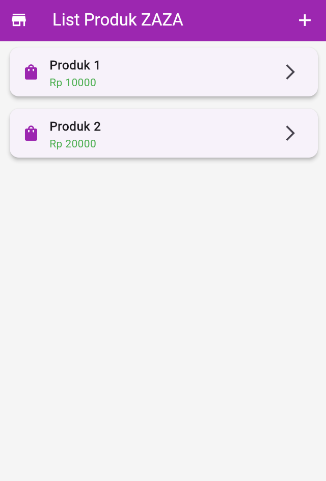
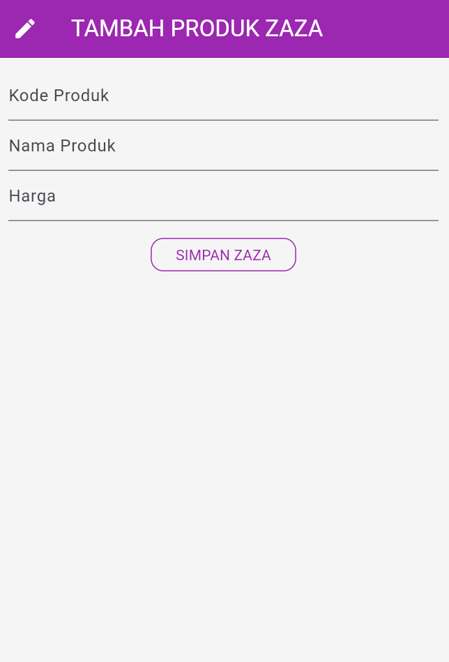
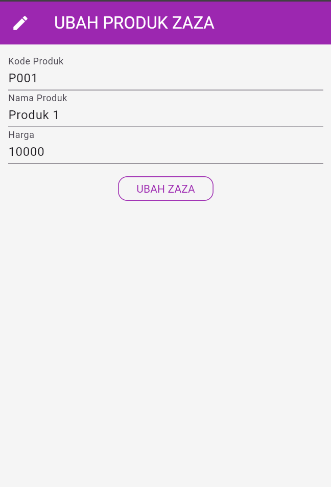

# TokoKita

TokoKita adalah aplikasi Flutter yang dirancang untuk mengelola produk di sebuah toko. Aplikasi ini menyediakan fitur untuk melihat daftar produk, menambah/mengedit detail produk, dan menghapus produk.

## Halaman

### Halaman Daftar Produk

Halaman ini menampilkan daftar semua produk yang diambil dari API. Pengguna dapat menyegarkan daftar, mengetuk produk untuk melihat detail, atau menambah produk baru menggunakan ikon '+' di app bar.

Komponen kode utama:
- Metode `fetchProduk()` untuk memuat produk secara asinkron.
- `ListView.builder` untuk menampilkan produk dalam kartu dengan nama dan harga.
- RefreshIndicator untuk fungsi tarik-untuk-segarkan.
- Navigasi ke `ProdukDetail` saat diketuk dan `ProdukForm` untuk menambah.
- Mengambil ulang data setelah kembali dari halaman detail atau form.

### Halaman Detail Produk

Halaman ini menunjukkan informasi detail tentang produk yang dipilih, termasuk kode, nama, dan harga. Pengguna dapat mengedit atau menghapus produk dari halaman ini.

Komponen kode utama:
- Menampilkan data produk dalam widget Card dengan ikon.
- Widget `_tombolHapusEdit()` dengan tombol Edit dan Delete.
- Edit menavigasi ke `ProdukForm` dengan data produk.
- Delete menampilkan dialog konfirmasi dan memanggil `ApiService.deleteProduk()`.
- Jika berhasil dihapus, menavigasi kembali ke daftar produk.

### Halaman Form Produk (Tambah Produk)

Halaman ini digunakan untuk menambah produk baru. Pengguna mengisi kode produk, nama, dan harga. Form memvalidasi bahwa semua field diisi sebelum mengirim.

Komponen kode utama:
- Judul dan teks tombol dinamis berdasarkan apakah sedang edit atau tambah.
- TextFormField untuk kode, nama, dan harga (keyboard numerik untuk harga).
- Validasi memastikan field tidak kosong.
- Saat kirim, membuat objek `Produk` dan memanggil `ApiService.createProduk()`.
- Menavigasi kembali dengan flag sukses saat selesai.

### Halaman Form Produk (Edit Produk)

Halaman ini digunakan untuk mengedit produk yang ada. Form diisi sebelumnya dengan data produk saat ini. Pengguna dapat memodifikasi field dan menyimpan perubahan.

Komponen kode utama:
- Mirip dengan form tambah, tetapi menginisialisasi controller dengan data yang ada di `initState()`.
- Memanggil `ApiService.updateProduk()` dengan ID produk dan data yang diperbarui.
- Logika validasi dan pengiriman identik dengan form tambah.