# TokoKita

TokoKita adalah aplikasi Flutter yang dirancang untuk mengelola produk di sebuah toko. Aplikasi ini menyediakan fitur login, registrasi, dan CRUD (Create, Read, Update, Delete) untuk produk.

## Halaman UI

### Halaman Login

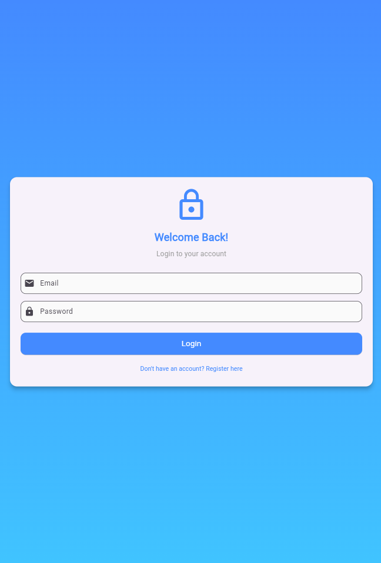

Halaman login memungkinkan pengguna untuk masuk ke aplikasi dengan email dan password.

**Proses Login:**
a. 
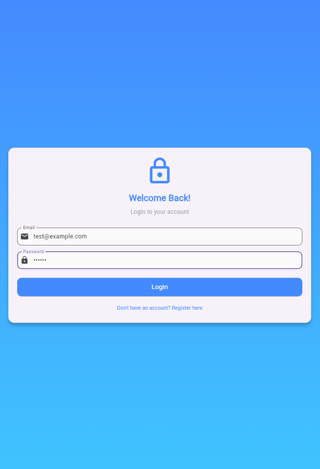

   Menginputkan email dan password di form login.
   - Kode: TextFormField dengan validator untuk email dan password.
   - Contoh input: Email: test@example.com, Password: 123456
b. Klik tombol "Login".
   - Kode: `LoginApi.connect(email, password)` dipanggil.
   - Jika berhasil, navigasi ke ProdukPage dan simpan token.
   - Jika gagal, tampilkan dialog error.

### Halaman Registrasi

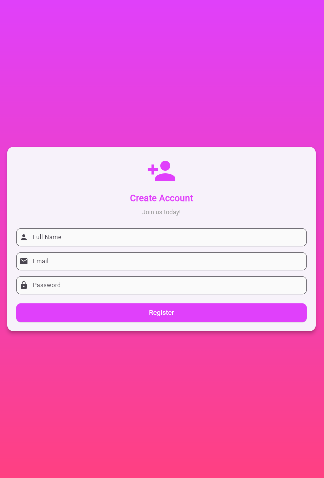

Halaman registrasi untuk membuat akun baru.

**Proses Registrasi:**
a. Isi form nama, email, password, dan konfirmasi password.
   - Kode: TextFormField dengan validasi (nama min 3 char, email valid, password min 6 char, konfirmasi sama).
b. Klik tombol "Register".
   - Kode: `RegistrasiBloc.registrasi()` dipanggil dengan data form.
   - Jika berhasil, tampilkan dialog sukses dan kembali ke login.
   - Jika gagal, tampilkan dialog error.

### Halaman Daftar Produk

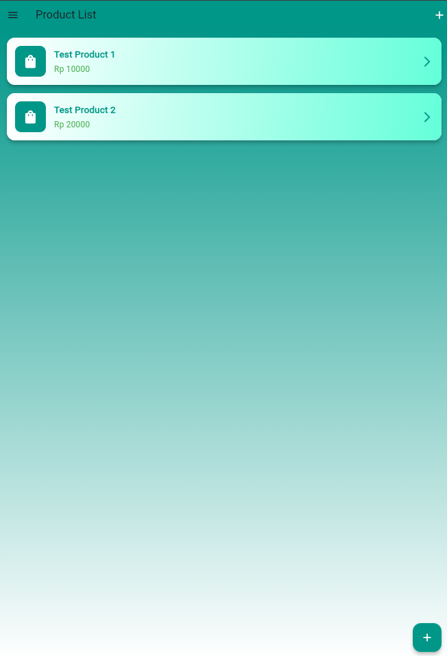

Menampilkan daftar produk dari API.

**Proses Read Produk:**
- Kode: `ProdukBloc.getProduks()` dipanggil di FutureBuilder.
- Menampilkan list produk dalam Card dengan nama dan harga.
- Klik produk untuk detail, ikon + untuk tambah.

### Halaman Detail Produk

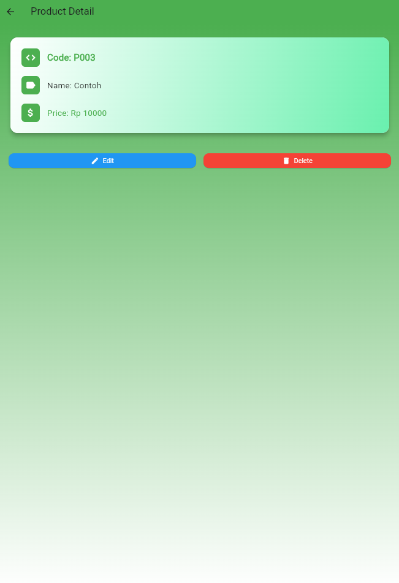

Menampilkan detail produk dan opsi edit/hapus.

**Proses Detail:**
- Kode: Menampilkan data produk dalam Card.
- Tombol Edit: Navigasi ke ProdukForm dengan data produk.
- Tombol Delete: Konfirmasi dialog, lalu `ProdukBloc.deleteProduk()`.

### Halaman Form Produk (Tambah)

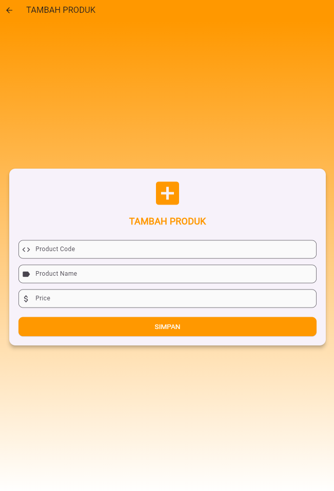

Form untuk menambah produk baru.

**Proses Tambah Produk:**
a. 
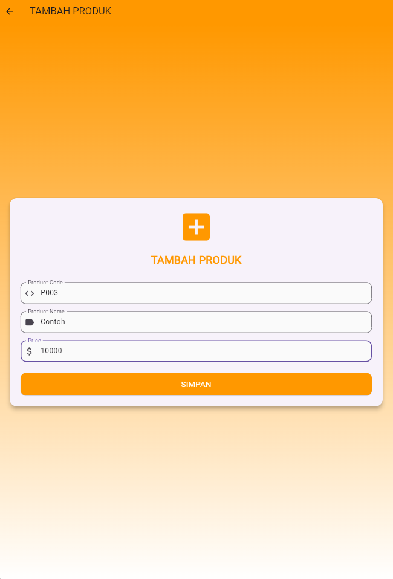

   Isi kode produk, nama, harga.
   - Kode: TextFormField dengan validasi tidak kosong.
b. 
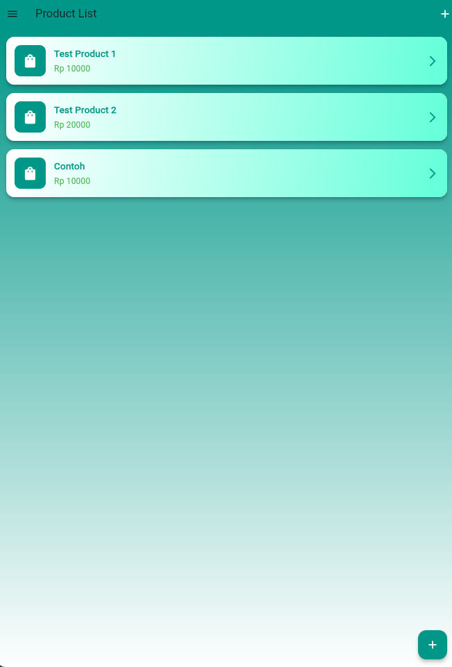

   Klik "SIMPAN".
   - Kode: Buat objek Produk, panggil `ProdukBloc.addProduk()`.
   - Jika berhasil, kembali ke daftar produk.

### Halaman Form Produk (Edit)

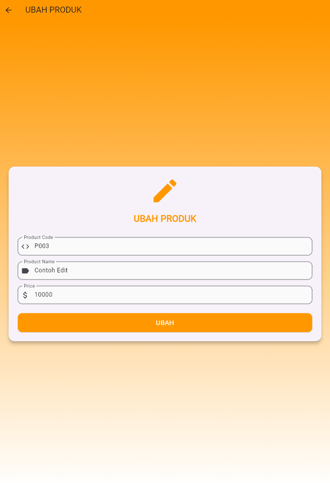

Form untuk mengedit produk.

**Proses Edit Produk:**
a. Form diisi dengan data existing.
   - Kode: initState() set controller dengan produk data.
b. 
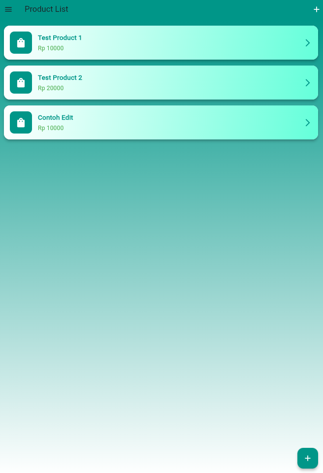

   Modifikasi field dan klik "UBAH".
   - Kode: `ProdukBloc.updateProduk()` dengan data baru.
   - Jika berhasil, kembali ke daftar.

### Proses Hapus Produk

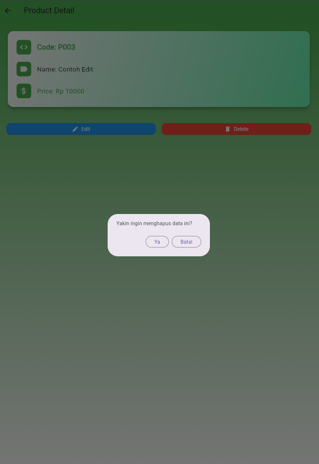

Proses menghapus produk dari halaman detail.

- Kode: Dialog konfirmasi, jika ya panggil `ProdukBloc.deleteProduk()`.
- Jika berhasil, kembali ke daftar produk.

## Teknologi

- Flutter untuk UI
- HTTP untuk API calls
- SharedPreferences untuk penyimpanan token
- Bloc pattern untuk state management